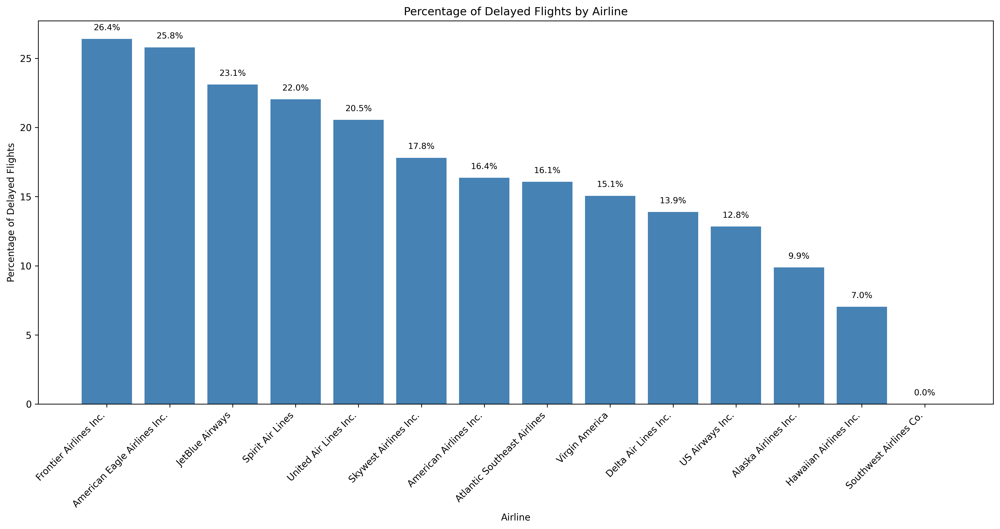

# Flight Delay Analytics

A Python CLI tool for querying and visualizing flight delay data using SQL and pandas.

## Features
- Query flights by ID, date, airline, or airport
- SQL injection-safe parameterized queries via SQLAlchemy
- Automated delay percentage reports with matplotlib visualization

## Tech Stack
Python · SQLAlchemy · SQLite · Pandas · Matplotlib

## Sample Output

## How to Run
\`\`\`bash
pip install sqlalchemy pandas matplotlib
python main.py
\`\`\`

## Project Structure
- `main.py` — Interactive CLI with input validation
- `flights_data.py` — Database queries via SQLAlchemy
- `plotting.py` — Data analysis and visualization
